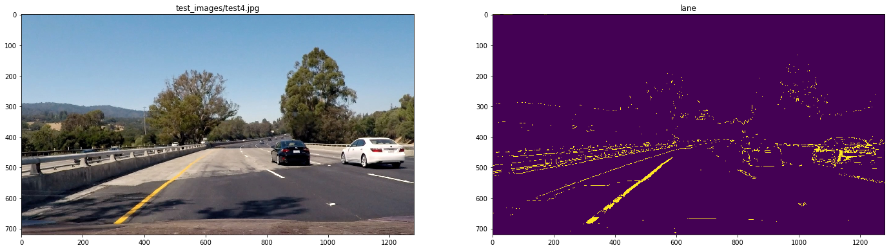
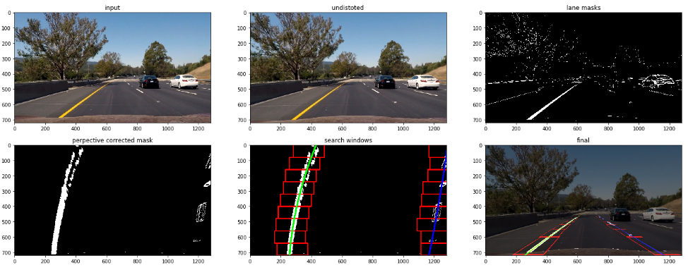

# Advanced Lane Finding

## [Udacity Self Driving Car Nanodegree: Computer Visison Project](https://in.udacity.com/course/self-driving-car-engineer-nanodegree--nd013/)

The goal of this project was to identify driving lanes in videos, captured by a car camera, using computer vision techniques. Here is a step-by-step summary of the how the code works:

1. Camera calibration matrix and distortion coefficients are obtained from included calibration chessboard images.
2. Raw image is undistorted using the matrix and coeefiicients obtained in the calibration step.
3. A combination of Sobel transforms and thresholding in HSV colorspace is used to higlight lane edges in the image.
4. The perspective of the transformed image is changed to top view or bird's eye view.
5. Pixels beonging to lanes are identified using sliding window search.
6. Curvature of the road is estimated from the identified lane pixels.
7. A polynomial is fitted to the lane pixels.
8. Lanes are plotted on top of the top view of the image using the polynomial fitted above.
9. An inverse perspective transform is performed, so the plotted lanes and curvature information transfer back to the original image.
10. In case of a video all the steps above are repeated or every frame.

Details of these steps follow:

## Camera Calibration
The purpose of camera calibration is to estimate the parameters of the lenses and image sensor of a camera. This information is then used to remove distortions caused by that camera. To calibrate the camera two lists of coordinates are needed: The first list, called object points, contains the coordinates of some arbitrary points on a real-world objects while the second list, called image points, has the coordinates of the same points in camera images of the object. For this project we used the 20 chessboard calibration images provided by Udacity in the directory [camera_cal](https://github.com/farhanhubble/CarND-Advanced-Lane-Lines/tree/master/camera_cal). Object points were generated in code assuming 9 internal corners in the horizontal direction and 6 in the vertical direction in every image and corresponding image points were obtained by calling **cv2.findChessboardCorners()**. This API was able to identify imgae points in 17 out of 20 images.

The object points, image points were then passed to **cv2.calibrateCamera()**, which is the API that calculates the camera parameters. Shown below is one of the calibration images with chessboard corners drawn over it.

Once the calibration was done, the following steps were executed for every video frame.

## Undistortion
Every video frame was undistorted using the parameters obtained in the calibration step. **OpenCV** API **cv2.undistort()** was used for this purpose. The section named **Testing Undistortion** has some test code for monitoring the effect of undistortion. Undistortion was first tested on the calibration images themselves. Here is one such image and its undistorted version compared side by side.

Here is how an image taken from the car's camera looks like before and after undistortion.

Effects of undistortion are most noticeable near the edges of the images. In the image of the road, the car's hood, visible at the bottom has shrunk substantially.

## Binary Mask Evaluation
To find edges in the frame image a set of Sobel transfroms were combined with thresholding in the HLS colorspace. The thresholds for both Sobel transforms as well as color threshoding were computed manually by trial and error. This was done only once and not performed for every frame. 

Some of the masks that were tested can be visualized by enabling the **__DEBUG__** flag in the topmost cell and executing the function **visualize_candidate_masks()**. Here's a sample image from the experimentation phase.

Final value of the thresholds and the right combination masks were decided based on the following observations:
1. X and Y Sobel masks alway identify edges belonging to lane markings but also include other edges.
2. A Sobel angle mask will have dense regions where yellow markings are present but has uniform noise.
3. S channel highlights the lane markings clearly if images have good saturation.
4. L channel can be combined with S channel to exclude edges from low-lit areas.

The parameters in the evaluation phase were tuned to detect the lane lines in nearly all frames of the project video. 

Final thresholds are avilable throughout the notebook by calling **get_thresholds()** and the combined mask used on all video frames is obtained by calling **get_lane_mask()**. Here is  summary of the mask names and corresponding thresholds:

| Mask Name | Thresholds | Description                                                 |
|-----------|------------|-------------------------------------------------------------|
| s_mask    | (170,255)  | S channel mask in the HSV colorspace.                       |
| l_mask    | (50,250)   | L channel mask in the HSV colorspace.                       |
| mag_mask  | (80,150)   | Absolute magnitude of Sobel operator in x and y directions. |
| ang_mask  | (0.85,1.0) | Angle mask dereived as the inverse tan of Sobel y and x     |

## Binary Mask Application
The final mask  **mag_s_mask = (mag_mask | s_mask) | (ang_mask & s_mask) & l_mask** was applied to every video frame.

As can be seen in the images below the mask performs very well under different conditions.

## Computing Warping Matrices
Warping and unwarping matrices were computed for transforming an image to its bird's eye view. The warping parameters were caculated using **get_persprective_transforms()** function. The reference image used for coordinate calcualtions was ['test_images/straight_lines1.jpg'](test_images/straight_lines1.jpg). Shown below is the effect of warping on the reference image and a test image. This was again only done once.

The source and destination coordinates used are listed below. The points were selected by manual inspetion of reference the reference image.

**perspective_src_points = [(203,720),(1099,720),(707,463),(580,463)]**

**perspective_dst_points = [(203,720),(1099,720),(1099,0),(203,0)]**

## Applying Perpective Warping
For every video frame, the binary image generated by applying the mask described above was warped to a bird's eye view perspective. Warping was done using the matrices generated by **get_persprective_transforms()**. A sample of applying perpective correction can be viewed in the lane search section below.

## Lane Search
After applying warping, the binary mask image of a video frame was fed to the function **find_lanes()**. 

If no informtion about lane pixels in the previous frame is passed to this function it uses a histogram of bright pixel counts to identify the bases of the lanes in the lower half of the binary mask, followed by sliding window search to identify the rest of the lanes. 

On the other hand if poynomials describing the position of the lanes in the previous frame are passed to this function, it searches only in a narrow region around the previous lanes. The image below shows how lane search is performed in the former case. 

In either case the function returns lists of pixels that it identified as beonging to left and right lane markings.

## Curvature and Displacement Calculation
The raw pixel positions returned by **find_lanes()** were converted to distance in meters using information about the actual width of the lanes and the actual height of the frame images. Polynomials are fitted to these values and radius of curvature and displacement are calculated. Thee calculations are well documented in the notebook.

## Fitting Polynomials and Displaying Output
A quadratic polynomial is fitted to the lane coordinates identified by **find_lanes()**. The poynomial is plotted over the warped image. The region between the lanes is filled with a color to make it visible in the video. 

## Unwarping The binary Mask
Once the polynomials are displayed on top of the warped binary mask, the mask is unwarped and overlayed on top of the input frame image. The unwarped output with poynomials and search windows plotted over them can be seen in the last image above.

## Maintaining Lane History
To make lane plotting and other calculations smooth the previous 5 polynomials were cached using the **LaneHist** class. The caching was not done for outlier frames.

## The Pipeline
The code inside **draw_lanes()** runs all the steps described above. It also checks for outiers frames and caches lane information. This function was called for every frame in the video.

## Results
The pipeline was applied to the [project_video.mp4](https://github.com/farhanhubble/CarND-Advanced-Lane-Lines/blob/master/project_video.mp4) and the resulting video saved as [processed-project_video.mp4](https://github.com/farhanhubble/CarND-Advanced-Lane-Lines/blob/master/processed-project_video.mp4). The output video shows smooth lane detection and sensible values of radius and displacemnent. The output video can also be viewed on [YouTube](https://www.youtube.com/watch?v=3TUH5pvMmcI).

